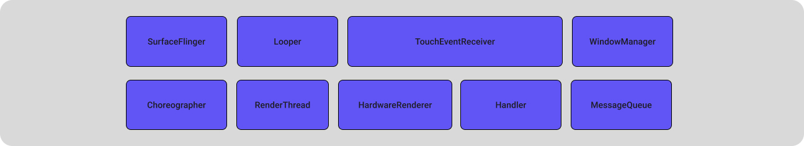
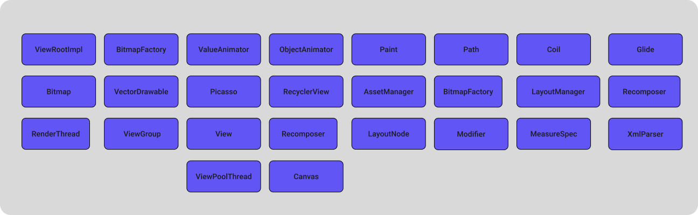

+++
title = 'Overview Frame Timeline'
date = 2026-02-20T07:07:07+01:00
draft = false
+++

# Frame Timeline: An Entry Point for App Performance Analysis

**Goal:** This article provides an introductory overview of using Frame Timeline to analyze performance issues in Android applications. Frame Timeline is one of the primary starting points for identifying and troubleshooting UI bottlenecks.

> **Disclaimer:**
> This guide assumes you have a basic familiarity with Android traces and `perfetto-trace`. If not, here is a list of materials to check out before moving forward (or don't—manage your own life!):
> * [Tracing 101](https://perfetto.dev/docs/getting-started/start-using-perfetto) — The basics: what tracing is and why it’s needed.
> * [FrameTimeline: Jank detection](https://perfetto.dev/docs/data-sources/frametimeline) — Understanding frame composition.

---

## Frame Timeline


This is an Android tool that provides information about the sequence of frames and their duration. It allows you to detect **Jank** — dropped frames in animations and the user interface that lead to a negative user experience.

### Quick Primer: 
* **Expected Timeline** — Displays the ideal sequence of frames without delays.
* **Actual Timeline** — Displays the real sequence of frames, where red sections indicate delays exceeding the VSync budget (e.g., 16.6ms for 60Hz).

### Anatomy of the Frame Timeline


 **General Workflow**
 - VSync → DisplayEventReceiver receives the event.
 - Main Thread → Choreographer (scheduling) → ViewRootImpl (traversing the UI) → Recomposer (calculating Compose state changes) → AndroidComposeView rendering into the `DisplayList`.
 - Sync Phase → HardwareRenderer blocks the Main Thread to hand over data to the `RenderThread`.
 - RenderThread → DrawFrameTask executes draw commands via `Skia/Vulkan`.
 - System Layer → SurfaceFlinger handles composition and pushes the buffer to the display.

> **Source Code References**
> - [DisplayEventReceiver](https://cs.android.com/android/platform/superproject/main/+/main:frameworks/native/services/displayservice/include/displayservice/DisplayEventReceiver.h): Receives VSync from SurfaceFlinger. Starts the cycle.
> - [Choreographer](https://cs.android.com/android/platform/superproject/main/+/main:frameworks/base/core/java/android/view/Choreographer.java): doFrame: Input, Animation, and Traversal phases.
> - [ViewRootImpl](https://cs.android.com/android/platform/superproject/main/+/main:frameworks/base/core/java/android/view/ViewRootImpl.java): performTraversals: Starts Measure/Layout/Draw for the entire hierarchy.
> - [Recomposer](https://cs.android.com/androidx/platform/frameworks/support/+/androidx-main:compose/runtime/runtime/src/commonMain/kotlin/androidx/compose/runtime/Recomposer.kt): runRecompositionAndApplyChanges: Calculates snapshot state deltas.
> - [ComposeView](https://cs.android.com/androidx/platform/frameworks/support/+/androidx-main:compose/ui/ui/src/androidMain/kotlin/androidx/compose/ui/platform/ComposeView.android.kt): The bridge between Compose LayoutNode and the View system.
> - [HardwareRenderer](https://developer.android.com/reference/android/graphics/HardwareRenderer): syncFrameState: Transfers the DisplayList to the RenderThread.
> - [SurfaceFlinger](https://source.android.com/docs/core/graphics/surfaceflinger-windowmanager): Composites ready buffers.
---

## What Affects Frame Duration?

Every performance issue has an "address" — the specific place where it all started. 

### Breakdown

Before diving into the app code, you should **categorize** the involved classes into layers. This helps because:
1. It simplifies the overall understanding of a feature's architecture.
2. It makes it easier to pinpoint the zone of **low-performance** code.
3. It clarifies who to consult or what documentation to read for further analysis.

##### How to Cluster the Layers?

For most cases, the system can be divided into:

* **System UI Layer** — Classes responsible for frame display, rendering, and composition between your app and the OS.

* **System DATA Layer** — Classes responsible for data movement and utilization between the app and the system.

* **App DATA Layer** — Classes you use to move data within your own application.

* **App UI Layer** — Classes used to draw and composite the "pretty stuff" your designers requested.


##### Bottom-Up vs. Top-Down Analysis?

In most cases, it’s best to analyze the system **Bottom-Up**. This means analyzing the impact of your app's layers on the system layers. Typically, code written by engineering teams causes system-wide slowdowns, which in turn affects frame rendering speed. Most issues are hidden in the App Layer, so we'll start with the **App UI Layer**. 

#### How to Find Problematic Areas?

* If you see obvious "red" spots on the **Frame Timeline**, jump straight into a detailed search.
* If you prefer to spend your workday scrolling the timeline back and forth and diving into every single frame — I support that too!
However, for the fast and surgical approach, we use **Perfetto SQL**. By querying Perfetto’s data tables, we can generate structured reports for deep analysis. 

#### What Interests Us in the App UI Layer? 

* Main Thread contentions (locks).
* The duration of `traversal` (layout, measure, recomposition) and the subsequent execution on the `RenderThread`.

#### Analyzing Traversal and RenderThread Duration

```SQL
SELECT
  f.surface_frame_token AS frame_id,
  f.dur / 1e6 AS total_frame_dur_ms,
  (SELECT SUM(s.dur) / 1e6 FROM slice s 
   WHERE s.ts >= f.ts AND s.ts < (f.ts + f.dur) 
   AND s.name LIKE '%animation%') AS anim_ms,
  (SELECT SUM(s.dur) / 1e6 FROM slice s 
   WHERE s.ts >= f.ts AND s.ts < (f.ts + f.dur) 
   AND s.name = 'traversal') AS layout_ms,
  (SELECT SUM(s.dur) / 1e6 FROM slice s 
   WHERE s.ts >= f.ts AND s.ts < (f.ts + f.dur) 
   AND s.name = 'syncFrameState') AS sync_ms,
  (SELECT SUM(s.dur) / 1e6 FROM slice s 
   WHERE s.ts >= f.ts AND s.ts < (f.ts + f.dur) 
   AND s.name LIKE 'DrawFrame%') AS draw_ms
FROM actual_frame_timeline_slice f
WHERE f.dur > 1e6
ORDER BY total_frame_dur_ms DESC
LIMIT 30
```


#### Results


#### Table Breakdown
Let's look at the columns:

* **anim_ms** : animation time in the frame.

* **layout_ms** : layout time in the frame.

* **sync_ms** : synchronization time on the RenderThread.

* **draw_ms** : rendering execution time on the RenderThread.

#### Analysis

> **Context**: The trace was captured while scrolling the main feed of the application.

> * Analyze the `layout/animation` durations in the table.
> * Given the **total frame budget** of `16.6ms` for 60Hz and a strict `8.33ms` for 120Hz, these metrics suggest that the View hierarchy is heavily overloaded or that multiple animations are being triggered simultaneously.
> * **Potential Solution**: Optimize the View hierarchy and limit the number of concurrent animations per frame to stay within the VSync budget.

#### Finding Main Thread Contentions via SQL

```SQL
SELECT
  SUBSTR(
    s.name, 
    INSTR(s.name, 'owner ') + 6, 
    INSTR(s.name, ' (') - (INSTR(s.name, 'owner ') + 6)
  ) AS owner_thread_name,
  t.name AS blocked_thread,
SUBSTR(
    SUBSTR(s.name, INSTR(s.name, ' at ') + 4), 
    1, 
    INSTR(SUBSTR(s.name, INSTR(s.name, ' at ') + 4), '(') - 1
  ) AS method_name,
  s.name AS lock_details,
  p.name AS process_name,
  COUNT(*) AS occurrence_count,
  SUM(dur) / 1e6 AS total_dur_ms,
  MAX(dur) / 1e6 AS max_single_dur_ms
FROM slice s
JOIN thread_track tt ON s.track_id = tt.id
JOIN thread t USING (utid)
JOIN process p USING (upid)
WHERE s.name LIKE 'monitor contention%' AND blocked_thread LIKE 'ru.beru.android%'
GROUP BY owner_thread_name, blocked_thread, lock_details, process_name
ORDER BY total_dur_ms DESC
```

##### Query Results


#### Breakdown
> * Take the first row with the highest total lock duration:
> * Using a ViewPoolThread might trigger [ResourceImpl.obtainStyledAttributes](https://cs.android.com/android/platform/superproject/main/+/main:frameworks/base/core/java/android/content/res/ResourcesImpl.java;l=1500;drc=61197364367c9e404c7da6900658f1b16c42d0da;bpv=0;bpt=1), which calls [AssetManager.applyStyle](https://cs.android.com/android/platform/superproject/+/android-latest-release:frameworks/base/core/java/android/content/res/AssetManager.java;l=1266?q=AssetManager.java:1266&sq=). This method contains a synchronized block under the hood. Applying attributes from a background thread can inadvertently block the `Main Thread`.
> * With access to the codebase, you can trace this to a specific function and optimize it. Reducing View-hierarchy-related calls from background threads often mitigates these contentions.
> * View-hierarchy-related calls from background threads often mitigates these contentions.

#### Complexity of Integration and Interaction

Understanding individual classes is crucial, but real-world complexity arises from the interaction of multiple elements working simultaneously, especially on complex screens.
An interface built by different teams might suffer from incompatible architectural approaches or accumulated technical debt, leading to unexpected latencies.

- **The Key Question** : How do these components interact, and how does their combined work affect performance? This understanding is the foundation of advanced analysis.

---
## Key Takeaways
By understanding how classes operate both in isolation and in tandem (within the app and across the system), you can narrow down the list of "suspects" to specific methods.

- **Frame Timeline** is your compass. It won't always give you a ready-made answer, but it points you in the right direction. Red sections in the Actual Timeline aren't a death sentence — they are a signal to start a deep-dive analysis.

- **Perfetto SQL** is expertise automation. While manual trace scrolling is great for context, SQL queries turn a chaos of thousands of slices into a structured report. Grouping data by frame phases and hunting for monitor contention saves hours of tedious manual labor.

- **Clustering simplifies** the search. Dividing the system into System vs. App layers helps filter out the noise. If the bottleneck is in layout_ms, focus on the App UI layer; if you see locks/contention, investigate thread interaction and shared resources.

- **Performance is a measurable metric**. UI smoothness depends not just on your code, but on how efficiently it utilizes system resources. Optimizing a single synchronized block, flattening your View hierarchy, or reducing Recomposition counts can yield more "bang for your buck" than refactoring the entire business logic.

This article is just an introduction to the world of trace analysis. In upcoming posts, we will take a step-by-step look at each performance marker and the specialized tooling required to master them.
