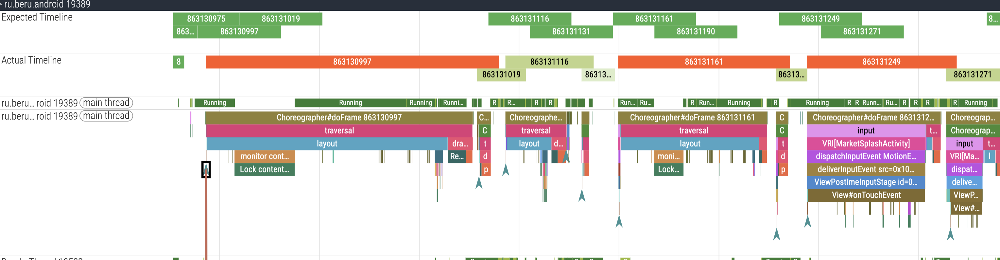
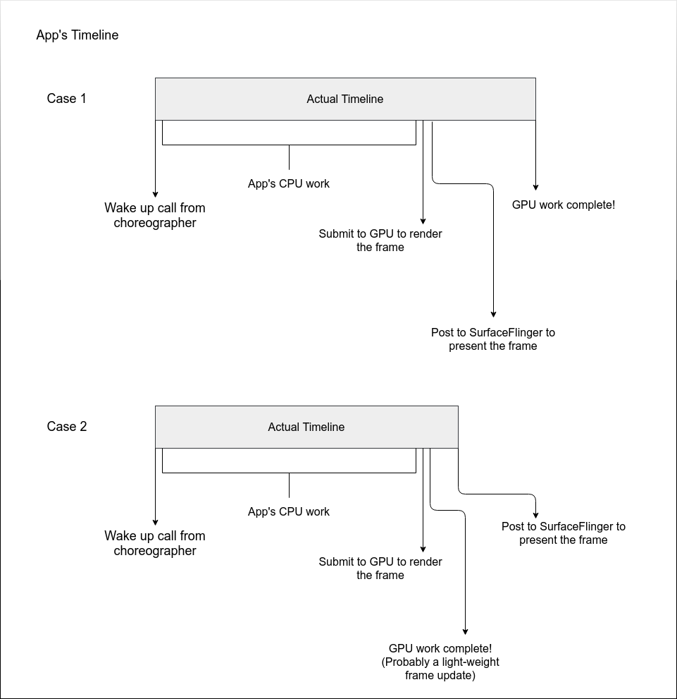
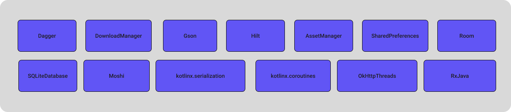
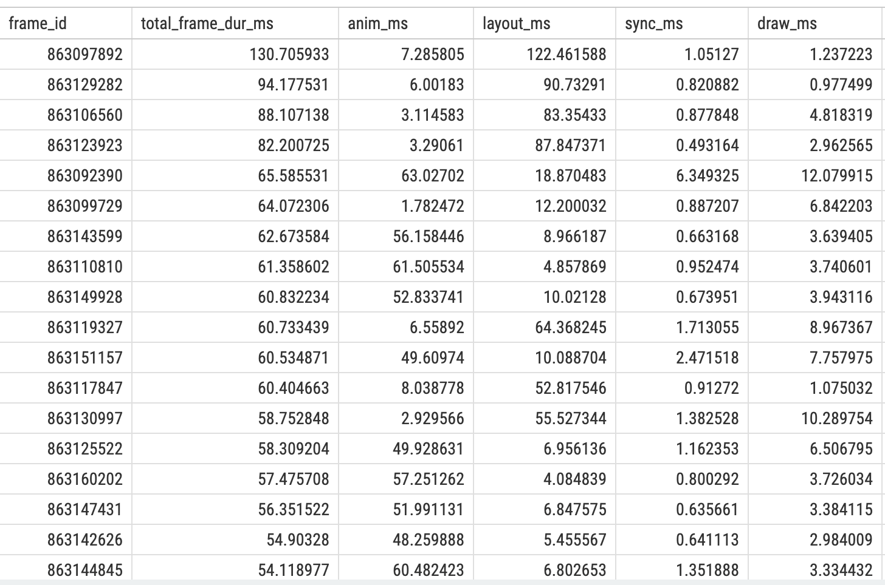
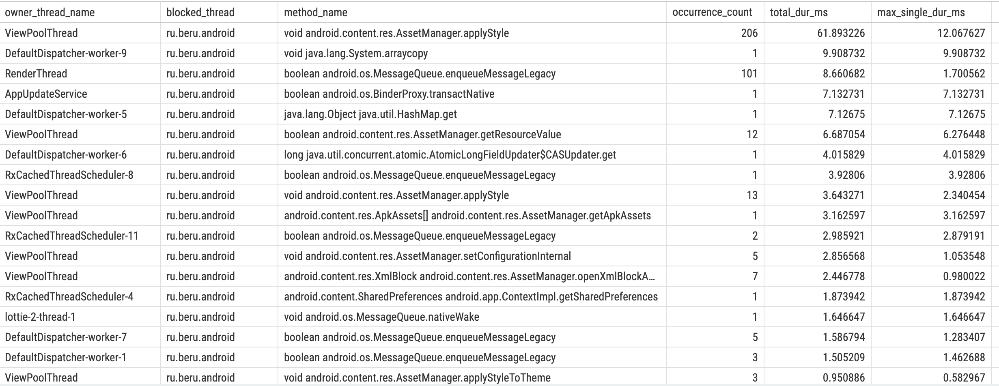

+++
title = 'Обзор Frame Timeline'
date = 2026-02-20T07:07:07+01:00
draft = false
+++

# Frame Timeline как входная точка анализа производительности приложения

**Цель статьи:** Эта статья представляет собой вводный обзор использования Frame Timeline для анализа проблем с производительностью Android-приложений. FrameTimeline - это одна из отправных точек для выявления проблем с производительностью приложений

> **Дисклеймер:**
> Подразумевается, что вы уже базово знакомы с трейсами и `perfetto-trace` в Android. Если нет — ниже список материалов, с которыми стоит ознакомиться, прежде чем идти дальше (или не идти — управляйте своей жизнью сами!):
> * [Tracing 101](https://perfetto.dev/docs/getting-started/start-using-perfetto) — база: что такое трассировка и зачем она нужна.
> * [FrameTimeline: Jank detection](https://perfetto.dev/docs/data-sources/frametimeline) — состав кадра.

---

## Frame Timeline



 Это инструмент в `Android`, предоставляющий информацию о последовательности кадров и их длительности. Он позволяет выявлять `Jank` - просадки в анимации и пользовательском интерфейсе, приводящие к негативному пользовательскому опыту.

### Краткий ликбез: 
* **Expected Timeline** — отображает идеальную последовательность кадров без задержек.
* **Actual Timeline** — отображает реальную последовательность кадров, где красные участки указывают на задержки, превышающие `16ms`.

### Анатомия Frame Timeline



 **Общая схема работы**
 - VSync → DisplayEventReceiver получение события.
 - Main Thread → Choreographer (планирование) → ViewRootImpl (трассировка всего UI) → Recomposer (расчет изменений Compose) → AndroidComposeView отрисовка в `DisplayList`.
 - Sync Phase → HardwareRenderer блокировка Main Thread для передачи данных в `RenderThread`.
 - RenderThread → DrawFrameTask выполнение команд отрисовки через `Skia/Vulkan`.
 - System Layer → SurfaceFlinger композиция и вывод на экран.

> Ссылки
> - [DisplayEventReceiver](https://cs.android.com/android/platform/superproject/main/+/main:frameworks/native/services/displayservice/include/displayservice/DisplayEventReceiver.h): Прием VSync от SurfaceFlinger. Старт цикла.
> - [Choreographer](https://cs.android.com/android/platform/superproject/main/+/main:frameworks/base/core/java/android/view/Choreographer.java;bpv=1;bpt=1): doFrame: фазы Input, Animation, Traversal.
> - [ViewRootImpl](https://cs.android.com/android/platform/superproject/main/+/main:frameworks/base/core/java/android/view/ViewRootImpl.java;l=322?q=ViewRoot&sq=&ss=android%2Fplatform%2Fsuperproject%2Fmain): performTraversals: старт Measure/Layout/Draw всей иерархии.
> - [Recomposer](https://cs.android.com/androidx/platform/frameworks/support/+/androidx-main:compose/runtime/runtime/src/commonMain/kotlin/androidx/compose/runtime/Recomposer.kt;l=565;drc=da44a8884b6ce31e31eff17d0f4a14a2cf311023) : runRecompositionAndApplyChanges: расчет разницы состояний Snapshots.
> - [ComposeView](https://cs.android.com/androidx/platform/frameworks/support/+/androidx-main:compose/ui/ui/src/androidMain/kotlin/androidx/compose/ui/platform/ComposeView.android.kt;l=574?q=ComposeView&sq=&ss=androidx%2Fplatform%2Fframeworks%2Fsupport): Мост между Compose LayoutNode и системой View.
> - [HardwareRenderer](https://developer.android.com/reference/android/graphics/HardwareRenderer): syncFrameState: передача DisplayList в RenderThread.
> - [SurfaceFlinger](https://source.android.com/docs/core/graphics/surfaceflinger-windowmanager): Композиция готовых буферов.
---

## Что влияет на длительность кадров?

Проблема длительности кадров и производительности в целом всегда имеет адрес, место откуда все началось. 

### Разбор

Прежде чем лезть в код приложения и идти по рабочим каналам, нужно **условно** кластеризовать участвующие классы в работе по слоям, потому что:
1. Будет проще понять общую схему фичи.
2. Будет проще определить зону, где может лежать потенциально **low performer** код.
3. Появится понимание, к кому можно сходить с вопросами и за документацией для дальнейшего анализа.

##### Как будем кластеризовать?

Для большинства случаев систему можно поделить на:

* **Системный UI-слой** — классы, которые отвечают за отображение кадра, отрисовку и компоновку этих кадров между вашим приложением и операционной системой.

* **Системный DATA-слой** — классы, отвечающие за движение данных и их утилизацию между вашим приложением и системой.

* **DATA-слой вашего приложения** — классы, которые вы используете для движения данных внутри вашего приложения.

* **UI-слой вашего приложения** — классы, которыми вы пользуетесь для того, чтобы нарисовать и скомпоновать что-то красивое (то, что захотели дизайнеры) в вашем приложении.


##### Как смотреть на эти слои: от системного уровня к уровню приложения или наоборот?

В большинстве случаев стоит рассматривать систему **снизу вверх**. То есть анализировать влияние слоев вашего приложения на системный слои:  код, написанный инженерами команд приводит к замедлению работы системы в целом, что в свою очередь, влияет на скорость отрисовки кадров. Как правило, проблемы кроются именно в слое приложения. Так и поступим и начнем с ui слоя приложения. 

#### Как найти проблемные участки ?

* Если визуально на `Frame Timeline` видны проблемные места, можно смело переходить к более быстрому и детальному поиску.
* Но если хотите провести рабочий день проскроллив `timeline` туда-сюда и проваливаться в каждый из кадров - я это тоже поддерживаю.
Возвращаясь к быстрому и детальному способу - это **Perfetto SQL**. Благодаря запросам к таблицам данных `Perfetto` можно получить таблицу интересующих параметров и значений для дальнейшего анализа. 

#### А что может заинтересовать в ui слое приложения ? 

* Блокировки Main потока
* Длительность `traversal`(layout,measure,recomposition) и последующие выполнения результата этих операций на `RenderThread`

#### Посмотрим длительность `traversal`(layout,measure,recomposition) и последующие выполнения результата этих операций на `RenderThread`

```SQL
SELECT
  f.surface_frame_token AS frame_id,
  f.dur / 1e6 AS total_frame_dur_ms,
  (SELECT SUM(s.dur) / 1e6 FROM slice s 
   WHERE s.ts >= f.ts AND s.ts < (f.ts + f.dur) 
   AND s.name LIKE 'animation') AS anim_ms,
  (SELECT SUM(s.dur) / 1e6 FROM slice s 
   WHERE s.ts >= f.ts AND s.ts < (f.ts + f.dur) 
   AND s.name = 'traversal') AS layout_ms,
  (SELECT SUM(s.dur) / 1e6 FROM slice s 
   WHERE s.ts >= f.ts AND s.ts < (f.ts + f.dur) 
   AND s.name = 'syncFrameState') AS sync_ms,
  (SELECT SUM(s.dur) / 1e6 FROM slice s 
   WHERE s.ts >= f.ts AND s.ts < (f.ts + f.dur) 
   AND s.name LIKE 'DrawFrame%') AS draw_ms
FROM actual_frame_timeline_slice f
WHERE f.dur > 1e6
ORDER BY total_frame_dur_ms DESC
LIMIT 30
```

##### Результат запроса



##### Пояснение по таблице 

* **anim_ms** время `animation` в кадре
* **layout_ms** время `layout` в кадре
* **sync_ms** Время синхронизации в **RenderThread** на `GPU`
* **draw_ms** Время отрисовки в **RenderThread** на `GPU`

##### Анализ

> * Посмотрев на длительность `layout/animation` в таблице можно сделать вывод, что иерархия представлений сильно перегружена раз эти методы занимают львиную долю длительности кадра. 
> * Как вариант решения - упрощать разметку и убирать вложенность отдельный представлений.

##### Найдем блокировки Main потока через **Perfetto SQL**

```SQL
SELECT
  SUBSTR(
    s.name, 
    INSTR(s.name, 'owner ') + 6, 
    INSTR(s.name, ' (') - (INSTR(s.name, 'owner ') + 6)
  ) AS owner_thread_name,
  t.name AS blocked_thread,
SUBSTR(
    SUBSTR(s.name, INSTR(s.name, ' at ') + 4), 
    1, 
    INSTR(SUBSTR(s.name, INSTR(s.name, ' at ') + 4), '(') - 1
  ) AS method_name,
  s.name AS lock_details,
  p.name AS process_name,
  COUNT(*) AS occurrence_count,
  SUM(dur) / 1e6 AS total_dur_ms,
  MAX(dur) / 1e6 AS max_single_dur_ms
FROM slice s
JOIN thread_track tt ON s.track_id = tt.id
JOIN thread t USING (utid)
JOIN process p USING (upid)
WHERE s.name LIKE 'monitor contention%' AND blocked_thread LIKE 'ru.beru.android%'
GROUP BY owner_thread_name, blocked_thread, lock_details, process_name
ORDER BY total_dur_ms DESC
```

##### Результат запроса


##### Разбор
> Возьмем 1 строку, т.к она имеет наибольший по времени суммарный лок
> * При использовании ViewPoolThread идет обращение к [ResourceImpl.obtainStyledAttributes](https://cs.android.com/android/platform/superproject/main/+/main:frameworks/base/core/java/android/content/res/ResourcesImpl.java;l=1500;drc=61197364367c9e404c7da6900658f1b16c42d0da;bpv=0;bpt=1), который в свою очередь внутри вызывает [AssetManager.applyStyle](https://cs.android.com/android/platform/superproject/+/android-latest-release:frameworks/base/core/java/android/content/res/AssetManager.java;l=1266?q=AssetManager.java:1266&sq=), который под капотом имеет `synchronized` блок, поэтому при применении атрибутов с внешнего потока, может блокироваться `main thread`.
> * Имея кодовую базу приложения можно дойти до конкретной функции в коде и оптимизировать ее. Кода приложения у меня нет, могу только предположить потенциальные места.
> * Оптимизировав обращения внутри View иерархии приложения, можно снизить количество блокировок.

#### Сложность Интеграции и Взаимодействие

Понимание роли каждого класса и технологии, перечисленных ранее важно. Однако, часто сложность заключается не в отдельном компоненте, а во взаимодействии множества элементов, работающих одновременно в одном приложении, особенно на сложных экранах.

Например, экран, собранный из компонентов, разработанных разными командами, может страдать от несовместимости подходов к разработке или накопленного технического долга.  Это приводит к неожиданным задержкам и проблемам с производительностью.

**Ключевой вопрос:** Как эти компоненты взаимодействуют друг с другом и как их совместная работа влияет на производительность приложения?  Это понимание – основа анализа.

---

## Общие выводы

- **Frame Timeline** — это ваш `компас`. Он не всегда дает готовый ответ, но четко указывает направление.
Ручной скроллинг трейса полезен для понимания контекста, но `Perfetto SQL` запросы позволяют превратить данные из тысяч слайсов в структурированный отчет, а дополнительная группировка по фазам кадра и поиск  потенциальных `monitor contention` экономят часы работы. 
- **Кластеризация упрощает поиск** - Разделение системы на слои `System/App` позволяет отсечь лишнее. Если проблема в `layout_ms` к примеру, мы идем в UI-слой приложения; если в `блокировках` — проверяем взаимодействие потоков и общие ресурсы.
- **Производительность это измеряемая величина** - Помните, что плавность интерфейса зависит не только от вашего кода, но и от того, насколько эффективно он утилизирует ресурсы системы. Оптимизация  использования одного `synchronized` блока или упрощение вложенности `View` или уменьшение количества `Recomposition` могут дать больше профита, чем переписывание всей бизнес-логики.

Данная статья — лишь вводная часть в мир анализа трейсов. В следующих материалах будем поэтапно проходиться по каждому маркеру и инструментарию.